# 微哈师校园生活服务平台的设计与实现

### 摘要

由于我校学生人数众多，由此会有一些比较典型的问题，例如每到教务平台访问高峰期时教务平台服务器会有比较大的压力，且每次操作过程略繁琐。微哈师校园生活服务平台以微哈师QQ小程序、微哈师Android客户端、管理员平台、超级管理员平台、全平台超级管理员授权工具客户端、超级管理员设备管理客户端六类用户平台为载体，服务于普通用户、班干部、班级管理员、超级管理员、项目Owner五种用户角色，使用较多的先进技术实现了用户部分课程表查询、成绩查询、校园地图、任务清单和管理部分身份鉴权、用户数据统计、通知和问卷的发布与管理、轮播管理等共三十余个功能点，在长期的开发迭代和运营积累了较为可观的用户量，成为了一个开发和运营体系较为完善的软件系统。

### 项目概述

本项目起始于2019年11月，项目初始版本作为2019QQ小程序应用开发大赛参赛作品，实现了每日打卡、任务清单、系统消息、课表查询和成绩查询五项核心功能。原始版本小程序使用第三方框架搭建UI界面，服务端使用Java和PHP后端技术实现。2020年初，在新版教务平台即将启用的背景下，项目进行了大幅度重构，先于其他第三方教务查询工具适配了新版教务平台，重新独立设计了小程序UI风格，新增了班级系统、问卷和任务清单设置提醒的功能，后端主要基于SpringBoot进行开发，开发语言由PHP+Java改为主要使用Kotlin，仅在个别业务场景中使用PHP，开发了管理员平台和超管平台以及Android端和Windows端的授权工具。在后面的时间里，项目不断完善，教务功能解析算法不断优化。2021年3月微哈师Android客户端启动开发，经过历时9个月的开发，公测版本于2021年12月上架应用商店。2022年2月超管设备权限验证机制升级，并随之开发了iOS和Mac端超管授权工具，实现了针对全平台的超管设备授权功能。本文对项目的介绍基于当前线上可用的功能和服务。

### 需求分析

微哈师校园生活服务平台包括五种用户角色和六类用户平台，五种用户角色包括：普通用户、班干部、班级管理员、超级管理员、项目Owner，六类用户平台包括：微哈师QQ小程序（简称：QQ小程序）、微哈师Android客户端（简称：Android客户端）、微哈师管理员平台（简称：管理员平台）、超级管理员平台（简称：超管平台）、全平台超级管理员授权工具客户端（简称：超管授权工具，全平台指Android、iOS、Windows、MacOS四大平台）、超级管理员设备管理客户端（简称：超管设备管理客户端）。

普通用户可以使用QQ小程序和Android客户端中的课表查询、成绩查询、校园地图等基础功能。

班干部相对于普通用户拥有更高的权限，除基础功能外，班干部可以使用班级模块中的通知发布和问卷发布功能向班级成员发布通知或问卷。

班级管理员可以使用管理员平台查看班级数据、管理班级成员、发布与管理班级通知和问卷。

超级管理员可以使用超管授权工具申请超级管理员权限，使用超管平台查看和管理系统数据、修改系统配置。

项目Owner可以使用超管设备客户端控制超管设备的权限。

### 项目架构

##### 业务架构

项目业务架构图如图TODO所示。

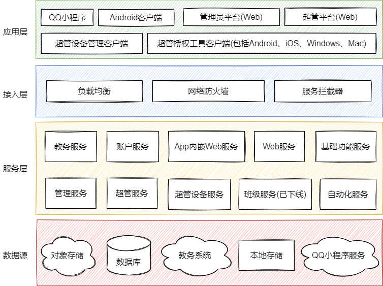

项目业务架构自底向上分为数据源、服务层、接入层、应用层。

数据源负责存储和提供数据，该层中的对象存储负责存储静态业务资源，如Banner图片、消息图片等；数据库负责存储业务数据；教务系统作为教务数据来源；本地存储负责存储临时文件；QQ小程序服务作为用户的QQ账户信息来源。

服务层负责处理业务逻辑，该层中的各项服务负责处理其对应的业务逻辑。

接入层负责网络请求的接入控制，该层中的负载均衡用于控制请求访问的服务实例，从而保障服务的可用性；网络防火墙负责控制请求访问的端口，从而保障服务的安全性；服务拦截器用于对请求的合法性进行校验。

应用层负责为用户提供操作平台，该层中的QQ小程序和Android客户端适用于普通用户，管理员平台适用于班级管理员，超管平台和超管授权工具客户端适用于超级管理员，超管设备管理客户端适用于项目Owner。

##### 技术架构

项目技术架构图如图TODO所示。

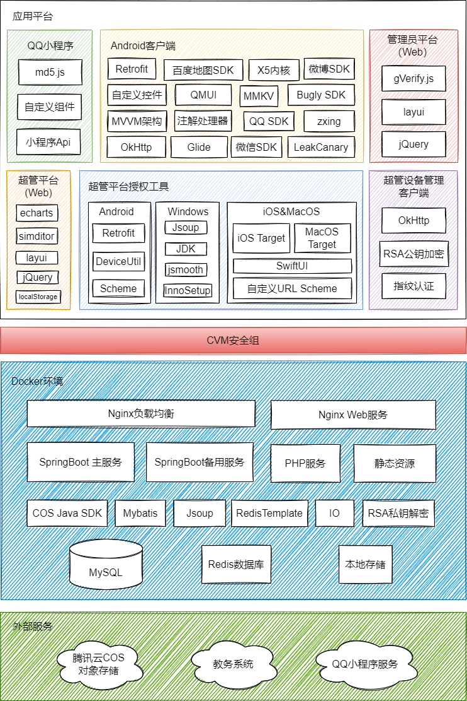

项目业务架构自底向上分为外部服务、Docker环境、CVM安全组、应用平台。

外部服务的功能由第三方实现，项目只需接入后进行调用即可。

Docker环境是所有服务的基础运行环境，内部可以大致分为四层，第四层和外部服务综合对应技术架构中的数据源，第三层和第二层综合对应业务架构中的服务层，第一层和CVM安全组综合对应业务架构中的接入层。第四层中MySQL和Redis数据库综合对应业务架构中数据源的数据库部分。第三层为数据操作中间层，其中的COS Java SDK是腾讯云官方提供的用于操作COS对象存储的工具；Mybatis用于与MySQL交互；Jsoup用于请求外部服务；Redis Template用于与Redis数据库交互；IO负责操作本地存储；RSA私钥解密负责业务数据的解密。第二层为服务主体，其中的SpringBoot主服务和SpringBoot备用服务承载了绝大多数的业务逻辑，PHP承载了个别业务逻辑。第一层中Nginx负载均衡可在SpringBoot主服务不可用时将请求发送到SpringBoot备用服务，Nginx Web服务用于支持PHP服务和静态资源请求。

CVM安全组负责服务器端口的访问控制，对应业务架构中接入层的网络防火墙，功能由腾讯云实现，只需在控制台进行配置。

用户平台对应业务架构中的应用层，由于项目涉及的技术过多，技术架构图中仅列出了该部分的一些主要技术，更多技术应用将在下文中介绍。

### 业务模块设计

##### 账户

###### 登录

账户登录涉及用户角色为普通用户、班级管理员，涉及技术平台为QQ小程序、Android客户端、管理员平台、服务端、MySQL数据库、QQ小程序服务、QQ服务，时序图如图TODO所示。

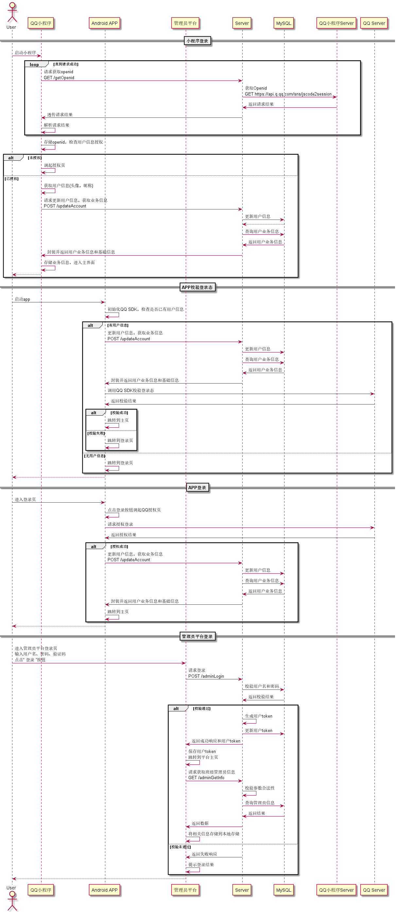

账户登录共有四个过程：小程序登录、APP登录态校验、APP登录、管理员平台登录。

小程序每次启动时会调用小程序框架的登录API获得一个登录凭证，小程序将登录凭证交给服务端，服务端使用登录凭证请求小程序服务接口换取openid，小程序服务接口响应后服务端将请求结果透传给小程序，小程序对结果进行解析以取得openid，拿到openid后调用小程序框架API检查是否有获取用户信息的权限，如无权限则调起授权页引导用户授权，授权完成后调用小程序框架获取用户信息API获取用户头像和昵称，获取成功后使用上述数据请求服务端，服务端将用户信息存储到数据库中并查询一些业务数据返回给小程序供小程序进行功能初始化。

Android端登录逻辑相对于小程序有一定区别，不同点在于小程序登录每次都需要执行完整的登录流程，而Android端在登录完成后可以获得一个token，后续可通过校验token来校验登录态。

Android端在已登录的情况下再次启动APP会先触发用户信息更新流程，更新完成后执行登录态校验流程，APP调用QQ SDK的API校验登录态，QQ SDK请求QQ服务接口校验token，校验通过后正常进入主页。

APP启动时如校验登录态失败或未登录会进入登录页，用户点击登录按钮会调起QQ授权界面，点击授权按钮会请求QQ服务接口进行授权，授权完成后执行更新用户信息的逻辑。

班级管理员进入管理员平台登录页后，管理员平台会调用gVerify.js生成验证码图片。用户输入用户名、密码、验证码，点击“登录”按钮，管理员平台会校验验证码，通过后请求服务端登录，服务端校验用户名和密码匹配后生成并更新用户token，返回成功响应给管理员平台，否则返回失败响应。管理员平台接收到响应后判断登录是否成功，如果登录未成功会显示错误提示，如果登录成功则存储token等信息并跳转到平台主页。管理员平台请求服务端获取管理员信息，服务端校验token正确后查询MySQL数据库中的管理员信息返回给管理员平台。管理员平台接收到成功响应后将管理员信息存储到本地存储。

###### 绑定教务平台

绑定教务平台涉及用户角色为普通用户，涉及技术平台为QQ小程序、Android客户端、服务端、教务平台服务，时序图如图TODO所示。

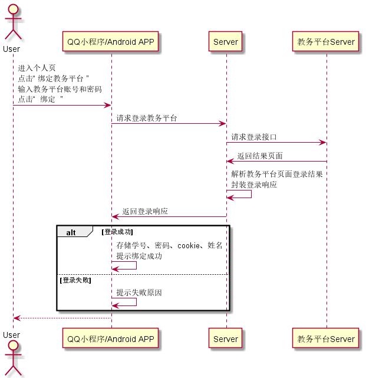

绑定教务平台的逻辑小程序和APP通用，用户进入个人页，点击“绑定教务平台”后在未绑定状态下会弹出教务平台账号密码输入框，用户输入账号和密码后小程序/APP会将上述数据交给服务端，服务端使用上述数据请求教务平台登录接口，服务端得到登录结果后返回结果响应给小程序/APP，小程序/APP得到结果后进行相应处理。

服务端请求教务平台接口登录的过程将在下文教务登录部分详细介绍。

###### 解绑教务平台

解绑教务平台涉及用户角色为普通用户，涉及技术平台为QQ小程序、Android客户端、服务端、教务平台服务，时序图如图TODO所示。

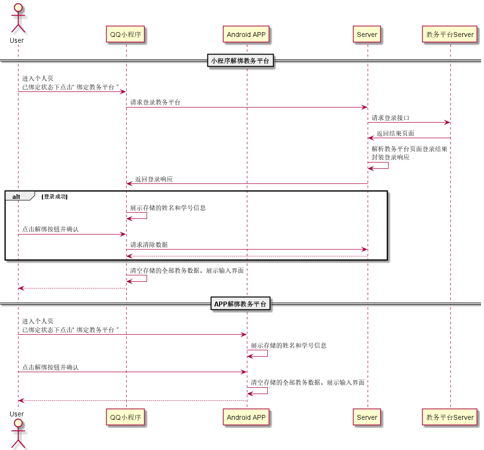

小程序端在已绑定状态下点击“绑定教务平台”会自动使用存储的账号和密码执行教务平台登录流程，如登录未成功会自动清除本地存储的全部教务数据，登录成功则展示绑定信息和解绑按钮，用户点击解绑按钮可以手动清除全部教务数据。

Android端在已绑定状态下点击“绑定教务平台”会直接展示绑定信息和解绑按钮，点击解绑按钮的效果与小程序相同。

###### 绑定邮箱

绑定邮箱涉及用户角色为普通用户，涉及技术平台为QQ小程序、服务端、MySQL数据库，时序图如图TODO所示。

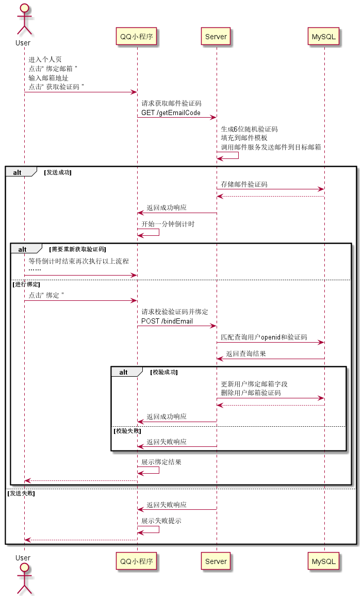

用户进入个人页在未绑定的状态下点击“绑定邮箱”会弹出邮箱输入对话框，用户输入邮箱后点击“获取验证码”小程序会使用邮箱请求服务端，服务端会生成一个6位的随机验证码并将验证码填充到邮件模板，调用邮件服务将验证码发送到邮箱后会将邮箱和验证码存入MySQL数据库，用户收到验证码后填写到小程序输入框点击“提交”后小程序将邮箱和验证码交给服务端，服务端在MySQL数据库中匹配查询邮箱和验证码，查询到结果为绑定成功，否则失败，如绑定成功服务端会更新用户的绑定邮箱并删除对应的验证码记录。

每个邮件验证码的有效时间为5分钟，服务端定时服务会每分钟执行一次删除创建时间达到5分钟的验证码。

###### 解绑邮箱

解绑邮箱涉及用户角色为普通用户，涉及技术平台为QQ小程序、服务端、MySQL数据库，时序图如图TODO所示。

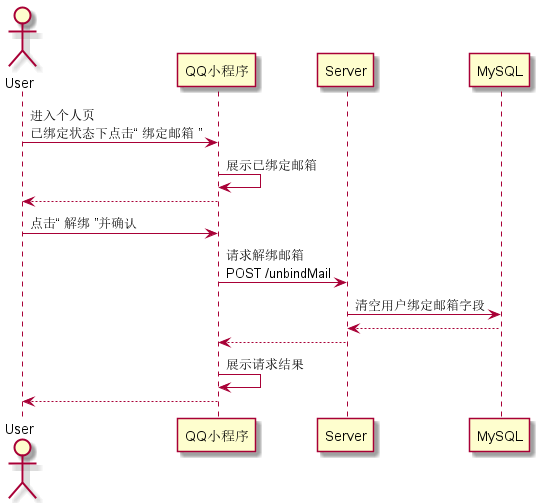

用户进入个人页在已绑定的状态下点击“绑定邮箱”会弹出已绑定邮箱对话框，用户点击解绑按钮并确认后小程序会请求服务端清空用户的绑定邮箱。

###### 清除数据

清除数据涉及用户角色为普通用户，涉及技术平台为QQ小程序、Android客户端、服务端，时序图如图TODO所示。

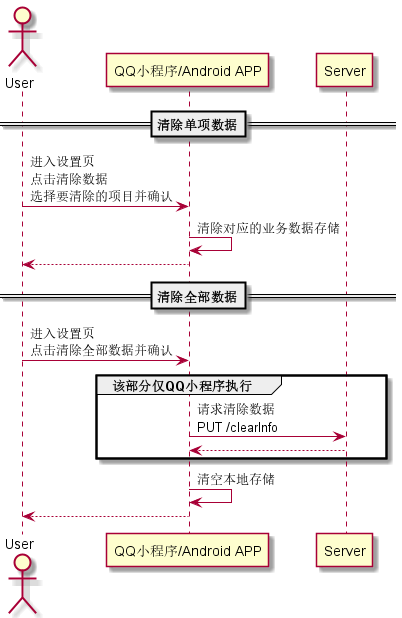

清除数据共有两个过程：清除单项数据和清除全部数据。

用户进入设置页，点击“清除数据”可以选择清除某一项数据，确认后小程序/APP会清除该项数据的本地存储。

如果用户点击“清除全部数据”并确认，小程序和APP都会清空本地存储的教务数据，小程序会另外请求服务端的清除数据接口，但此接口目前暂时不执行任何逻辑，所以两端清除全部数据的逻辑本质上是一致的。

###### 修改登录密码

修改登录密码

涉及用户角色为班级管理员，涉及技术平台为管理员平台、服务端、MySQL数据库，时序图如图TODO所示。

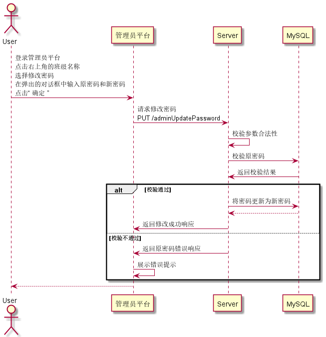

班级管理员登录管理员平台，点击右上角的班级名称，在下拉菜单中选择修改密码，在弹出的对话框中输入原密码和新密码，点击“确定”按钮，管理员平台会请求服务端修改密码。服务端校验参数合法性和原密码后将密码更新为新密码，管理员平台收到响应后提示修改结果。

###### 用户管理

用户管理涉及用户角色为超级管理员，涉及技术平台为超管平台、服务端、MySQL数据库，时序图如图TODO所示。

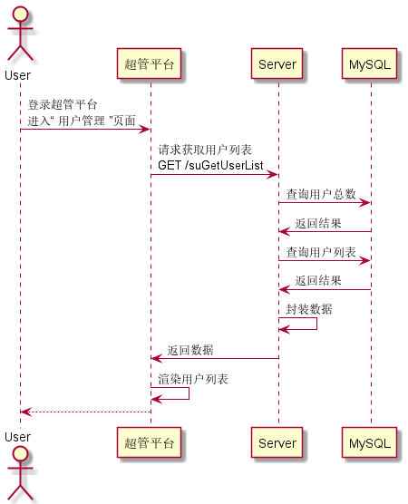

超级管理员登录超管平台进入“用户管理”页面，超管平台会分页请求服务端获取用户列表，服务端查询MySQL数据库中的用户总数和指定页的列表数据，经过封装后返回给超管平台，超管平台收到响应后将数据渲染到用户列表上。

###### 后台账户管理

后台账户管理涉及用户角色为超级管理员，涉及技术平台为超管平台、服务端、MySQL数据库，时序图如图TODO所示。

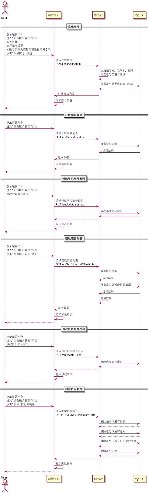

后台账户管理共有六个过程：生成账号、获取学院列表、修改学院账号密码、获取班级列表、修改班级账号密码、删除班级账号。

超级管理员登录超管平台进入后台账户管理页输入账户名称，选择账号类型，如果账号类型是班级账号还需选择归属的学院，点击“生成账号”按钮后超管平台会请求服务端生成账号，服务端随机生成账号id、用户名和密码保存到对应的表中并返回给超管平台。

超级管理员登录超管平台，进入后台账户管理页，超管平台会请求服务端获取学院列表，服务端查询MySQL数据库中的班级列表并返回给超管平台，超管平台收到响应后将数据渲染到学院列表上。

超级管理员点击学院列表中的密码单元格可以修改学院账号的密码，修改完成后超管平台会请求服务端更新MySQL数据库中学院账号的密码。

超级管理员点击学院列表中的“班级账号管理”按钮，超管平台会分页请求服务端获取学院下的班级列表，服务端查询班级总数和指定页的班级列表数据，经过封装后返回给超管平台，超管平台将数据渲染到班级列表中。

超级管理员点击班级列表中的密码单元格可以修改班级账号的密码，修改完成后超管平台会请求服务端更新MySQL数据库中班级账号的密码。

超级管理员点击班级列表中的“删除”按钮并确认，超管平台会请求服务端删除班级账号，服务端会依次删除班级账号关联的所有问卷、通知、成员，最后删除账号记录。

##### 教务

###### 登录

解绑教务平台涉及用户角色为普通用户，涉及技术平台为QQ小程序、Android客户端、服务端、教务平台服务，时序图如图TODO所示。

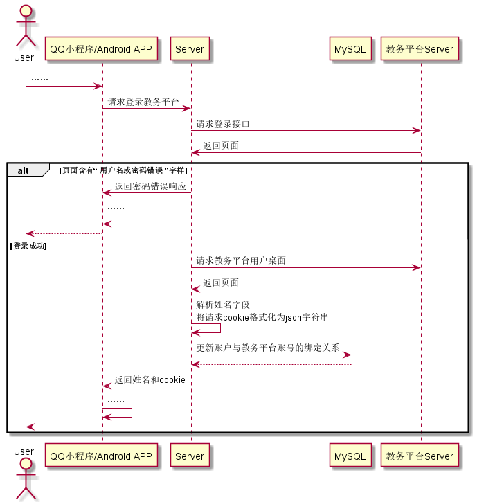

教务登录的逻辑为小程序和APP通用，用户触发登录逻辑后小程序/APP会将教务平台用户名和密码交给服务端，服务端使用Jsoup请求教务平台登录接口，教务平台会返回一个页面，如果密码错误页面里会有“用户名或密码错误”字样，如没有此文案则视为登录成功，如登录失败会直接响应到小程序/APP，登录成功则会使用登录获得的Cookie请求教务平台用户桌面页，服务端取得返回的页面后从页面内解析用户姓名，之后将姓名和Cookie封装成json并更新账户和教务平台的关联关系，将封装后的数据返回给小程序/APP，小程序/APP获得响应后执行其他逻辑。

###### 课表查询

课表查询涉及用户角色为普通用户，涉及技术平台为QQ小程序、Android客户端、服务端、教务平台服务，时序图如图TODO所示。

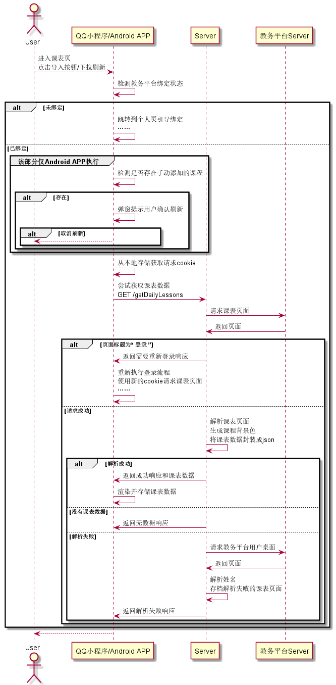

用户在小程序/APP触发课表查询逻辑后，小程序/APP会先检测是否已绑定教务平台，如未绑定会跳转到个人页引导用户绑定，已绑定状态下APP会检测目前是否存在手动添加的课程，如有则弹窗用户确认覆盖，后面小程序/APP会从本地存储获取上次登录成功的Cookie，使用Cookie请求服务端课表查询接口，如Cookie的登录态已失效服务端会返回需要重新登录的响应，小程序/APP重新执行登录流程后使用新的Cookie请求再次课表查询接口，服务端使用有效的Cookie请求教务平台课表页，教务平台响应后服务端从页面源码里解析课表数据并封装成json后返回给小程序/APP，小程序/APP将课表数据存储到本地并渲染到课表组件上。

###### 手动加课

手动加课涉及用户角色为普通用户，涉及技术平台为QQ小程序、Android客户端，时序图如图TODO所示。

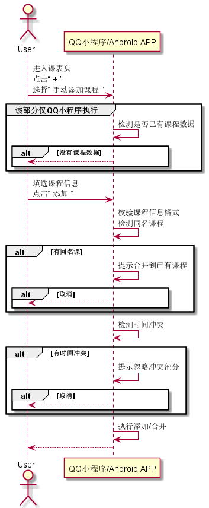

手动加课的逻辑为小程序和APP通用，用户点击课表页右上角的“+”图标，选择菜单中的“手动添加课程”，小程序会先检查是否已从教务平台查询到了课表，如未查询到该功能不可使用，APP无此限制，如可以添加课程小程序/APP会弹出表单对话框，用户填写要添加的课程信息后点击“添加”按钮，小程序/APP会校验表单完整性并检测已有课程是否与要添加的课程同名，如有同名课程会提示用户确认合并课程，之后小程序/APP会检测要添加的课程时间是否与已有课程的时间冲突，如有冲突则会取消添加/合并，否则执行添加/合并。

###### 成绩查询

成绩查询涉及用户角色为普通用户，涉及技术平台为QQ小程序、Android客户端、服务端、教务平台服务，时序图如图TODO所示。

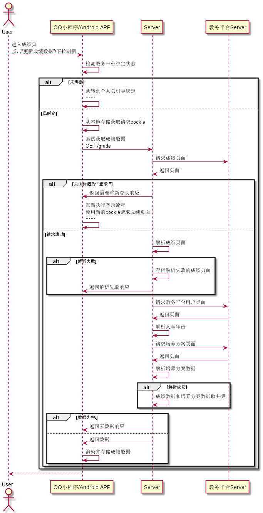

成绩查询的逻辑为小程序和APP通用，用户在成绩页触发成绩查询逻辑后，小程序/APP会先检测是否已绑定教务平台，如未绑定会跳转到个人页引导用户绑定，已绑定状态下小程序/APP会从本地存储获取上次登录成功的Cookie，使用Cookie请求服务端成绩查询接口，如Cookie的登录态已失效服务端会返回需要重新登录的响应，小程序/APP重新执行登录流程后使用新的Cookie请求再次成绩查询接口，服务端使用有效的Cookie请求教务平台成绩页，教务平台响应后服务端从页面源码里解析课表数据，服务端再次使用Cookie请求教务平台用户桌面页，解析出页面内的入学年份，再次使用Cookie请求教务平台培养方案页，解析出培养方案列表并结合入学年份推算已修成绩的具体学期，将所得数据与教务平台成绩页解析出的数据取并集，封装成json后返回给小程序/APP，小程序/APP将成绩数据存储到本地并渲染到成绩列表上。

##### 任务清单

###### 新建任务

新建任务涉及用户角色为普通用户，涉及技术平台为QQ小程序、服务端、MySQL数据库，时序图如图TODO所示。

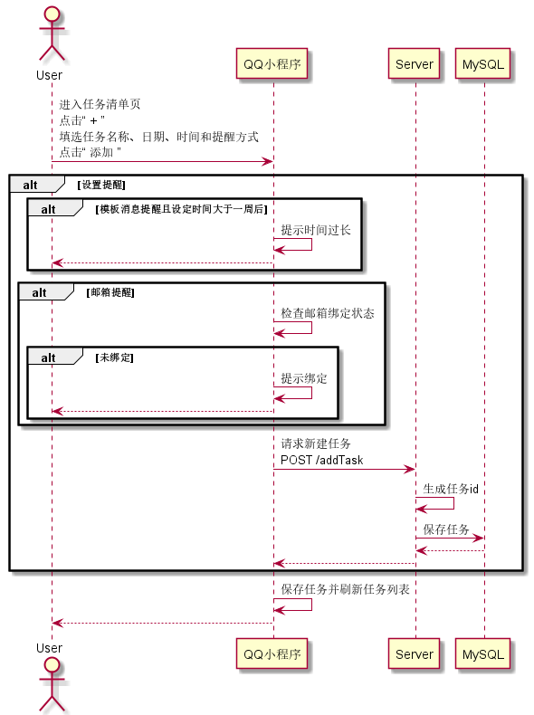

用户点击任务清单页右下方的“+”图标，小程序会弹出表单对话框，用户填写任务名称、选择提醒方式、点击“添加”按钮，如果设置了模板消息提醒要求时间不能超过一周，原因在于用于推送模板消息的formid有效期为一周，如果设置了邮箱提醒还需检查邮箱绑定状态，如果用户未绑定邮箱小程序会引导用户绑定邮箱，设置提醒的条件满足后小程序会请求服务添加任务接口，服务端会为任务生成一个id，将任务保存到数据库。

任务提醒的实现依赖于服务端的定时任务，服务端定时任务每分钟会查询数据库中需要执行提醒的任务，如果设置了模板消息提醒，服务端会构造模板消息，请求QQ小程序服务接口进行消息推送，如果设置了邮件提醒则调用邮件服务将提醒邮件发送到用户的绑定邮箱。

在请求QQ小程序服务接口进行消息推送时需要携带小程序的access_token，该参数由服务端定时任务每两小时请求QQ小程序服务接口进行获取。

###### 删除任务

删除任务涉及用户角色为普通用户，涉及技术平台为QQ小程序，时序图如图TODO所示。

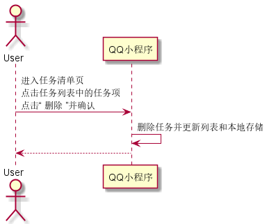

用户在任务清单页点击任务列表中的任务项，小程序会弹出任务详情对话框，用户点击对话框内的“删除”按钮并确认后小程序会将存储在本地存储的任务记录删除，如果任务设置了提醒，当任务被删除后提醒并不会被取消。

##### 校园地图

###### 数据更新

POI数据更新涉及用户角色为普通用户，涉及技术平台为Android客户端、服务端，时序图如图TODO所示。

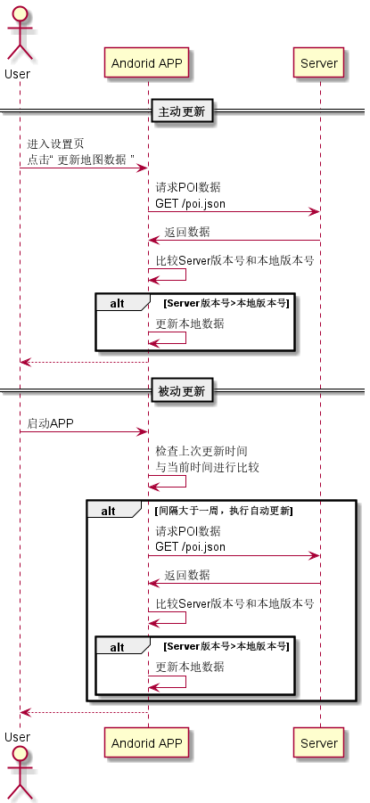

POI数据更新共有两个过程：主动更新和被动更新。

APP自身有一份内置的POI数据，用户点击设置页的“更新地图数据”，APP会请求服务端的静态POI数据文件，接收到服务端返回的POI数据后通过比对POI数据的版本号是否有更新，如有更新则将最新的数据存储到本地，在下一次更新时会将服务端版本号与本次存储数据的版本号进行比对，如有更新则覆盖本地存储数据。

在用户启动APP时，APP会检查地图数据上次更新时间是否已超过一周，如已超一周则执行被动更新，自动请求更新数据。

###### 地图展示

地图数据更新涉及用户角色为普通用户，涉及技术平台为Android客户端，时序图如图TODO所示。

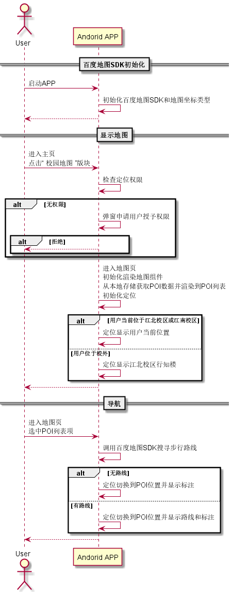

地图展示共有三个过程：百度地图SDK初始化、显示地图、导航。

在用户启动APP时，APP会自动进行SDK的初始化。

用户点击首页的“校园地图”版块时，由于地图相关功能需要定位支持，APP会先检查是否具有定位权限，如没有权限会弹窗提醒用户授权，若用户拒绝授予权限将无法使用地图相关功能，进入地图页后APP会先渲染地图组件、从本次读取地图数据渲染到POI列表并初始化定位，如果用户当前的位置在江南校区或江北校区，APP会显示用户当前的实际定位，如果用户在校外则会显示定位为江北校区行知楼。

用户选中POI列表项时，如果用户在选中地点所属校区内，APP会调用百度地图SDK查询用户当前位置到选中地点的步行路线，并将最优路线渲染到地图上，如果用户在校区外仅会标注选中地点的位置。

###### POI上报

POI上报涉及用户角色为普通用户，涉及技术平台为Android客户端、POI上报页面、服务端、MySQL数据库，时序图如图TODO所示。

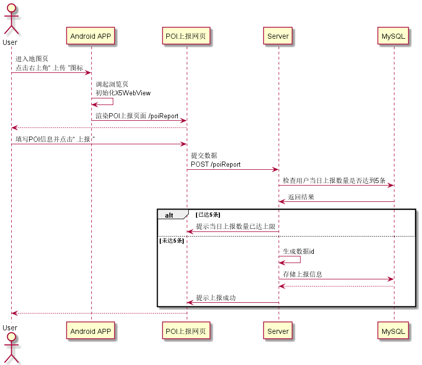

用户点击地图页右上角的“上传”图标，APP会跳转到内置的浏览器页面加载POI上报页面，用户在POI上报页面填写POI信息并点击“上报”后，POI上报页面会将表单提交到服务端，为了保证服务的安全性，POI上报接口添加了频控策略，限制每个用户每天最多可上报5条POI数据，仅当当日上报次数未达上限时才会将用户提交的POI信息存储到数据库中。

##### 消息(通知和问卷)

###### 发布通知

发布通知涉及用户角色为班干部、班级管理员、超级管理员，涉及技术平台为QQ小程序、管理员平台、超管平台、服务端、MySQL数据库、Redis数据库、本地存储、COS对象存储，时序图如图TODO所示。

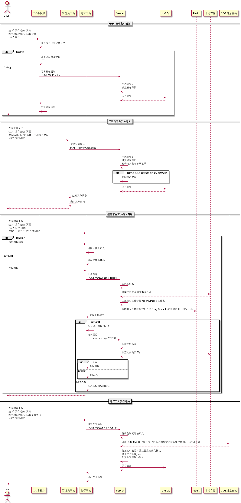

发布通知共有四个过程：小程序发布通知、管理员平台发布通知、超管平台正文插入图片、超管平台发布通知。

普通用户被设置为班干部后可以在小程序内的通知发布页发布通知，使用小程序发布通知的前提是用户绑定了教务平台，满足条件后用户可以在小程序内编写通知标题和正文，点击“发布”后小程序会请求服务端发布通知，服务端会在生成通知id、设置通知的发布范围后将通知保存到MySQL数据库。

班级管理员可以登录管理员平台进入通知发布页，输入通知标题、正文，选择通知分类是否置顶，点击“立即发布”，管理员平台会请求服务端发布通知，由于小程序的置顶消息与消息列表分开显示，置顶消息显示区域有限，所以限制班级管理员最多可以同时存在3条置顶消息，如设置置顶且置顶数量已达上限会以非置顶方式发布。

超管平台发布通知正文可以插入图片，超级管理员登录超管平台进入通知发布页，点击输入框上方的图标可以选择上传图片或插入外链图片，点击“外链图片”输入图片链接，编辑器会将外链图片插入到正文中，点击“上传图片”编辑器会调起文件选择器，选择文件之后编辑器会请求服务端图片上传接口，服务端接收到图片文件后对文件名进行编码，将图片存储到本地的图片缓存目录并将文件名格式化为key存储到Redis数据库中，设置key过期时间为1小时，生成临时图片链接返回给超管平台，编辑器会将临时图片插入到正文中。

当key在插入一小时后过期时，服务端会收到Redis数据库发布的消息，从消息内获得临时文件名，将临时文件删除。

超级管理员编辑完通知后点击“立即发布”，超管平台会请求服务端发布通知，服务端会解析前端编写的正文将正文拆分成文字和图片链接，检测图片链接中是否有临时图片链接，如有临时图片链接会调用COS Java SDK将临时图片文件存储到COS对象存储，将临时图片链接替换成永久链接，配置通知相关参数后将通知存储到MySQL数据库。

###### 通知管理

通知管理涉及用户角色为班级管理员、超级管理员，涉及技术平台为管理员平台、超管平台、服务端、MySQL数据库、COS对象存储，时序图如图TODO所示。

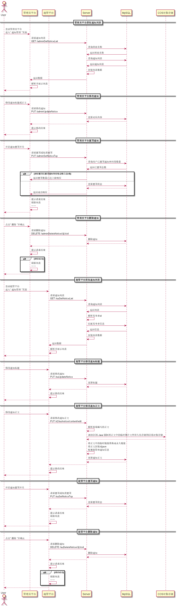

通知管理共有九个过程：管理员平台获取通知列表、管理员平台修改通知、管理员平台置顶通知、管理员平台删除通知、超管平台获取通知列表、超管平台修改通知标题、超管平台修改通知正文、超管平台置顶通知、超管平台删除通知。

班级管理员登录管理员平台进入通知管理页，管理员平台会分页请求服务端获取该管理员发布的通知列表，服务端会从MySQL数据库中查询班级名称和通知列表，经过封装后返回到管理员平台，管理员平台将数据渲染到通知列表上。

班级管理员点击通知标题或正文的单元格可以对标题或正文进行修改，修改完成后管理员平台会请求服务端更新MySQL数据库中通知的相应字段值。

班级管理员点击通知列表中的置顶开关，管理员平台会请求服务端开启或取消通知置顶，服务端会先检查置顶数量是否已达上限，如果已达上限则请求置顶失败，否则更新MySQL数据库中通知的置顶标志。

班级管理员点击通知列表中的“删除”按钮并确认，管理员平台会请求服务端删除MySQL中的通知记录。

超级管理员登录超管平台进入通知管理页，超管平台会分页请求服务端获取所有通知列表，服务端会从MySQL数据库中查询通知列表和对应的发布者信息，经过封装后返回到超管平台，超管平台将数据渲染到通知列表上。

由于超管平台正文可以插入图片，通知标题和正文修改的实现有一定的区别。

超级管理员点击通知标题单元格可以对标题进行修改，修改完成后超管平台会请求服务端更新MySQL数据库中通知的标题。

超级管理员可以直接在正文单元格内的编辑器里修改正文内容，对于图片的插入的处理逻辑与发布通知时相同，发布前使用临时文件，发布时将临时文件持久化存储到COS对象存储。

超级管理员点击通知列表中的置顶开关，超管平台会请求服务端开启或取消通知置顶，服务端将更新MySQL数据库中通知的置顶标志。

超级管理员点击通知列表中的“删除”按钮并确认，超管平台会请求服务端删除MySQL中的通知记录。

###### 发布问卷

发布问卷涉及用户角色为班干部、班级管理员、超级管理员，涉及技术平台为QQ小程序、管理员平台、超管平台、服务端、MySQL数据库，时序图如图TODO所示。

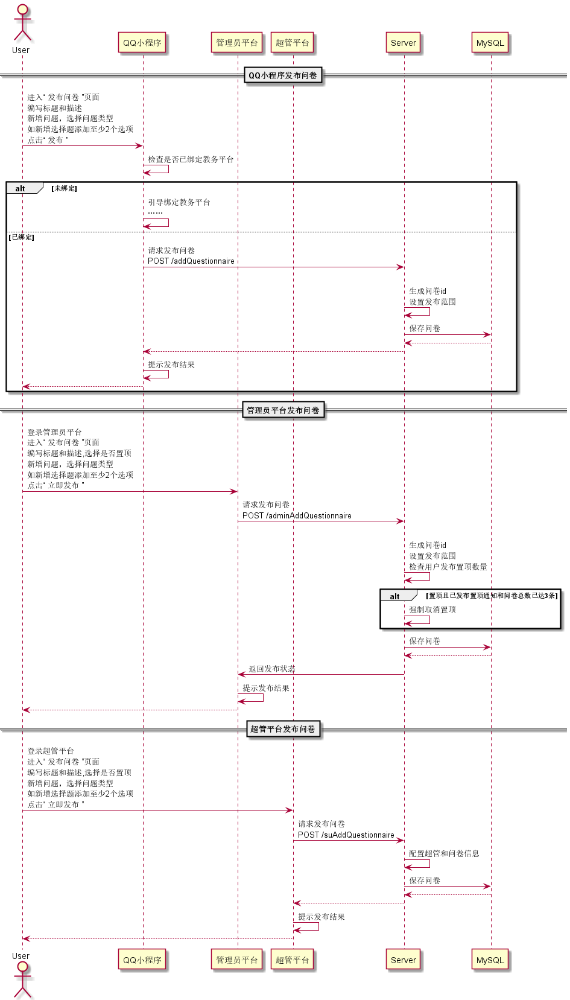

发布问卷共有三个过程：小程序发布问卷、管理员平台发布问卷、超管平台发布问卷。

普通用户被设置为班干部后可以在小程序内的问卷发布页发布问卷，使用小程序发布问卷的前提是用户绑定了教务平台，满足条件后用户可以在小程序内编写问卷标题和描述，至少添加一个问题，如果添加选择题需要至少添加两个选项，点击“发布”后小程序会请求服务端发布问卷，服务端会在生成问卷id、设置问卷的发布范围后将问卷保存到MySQL数据库。

班级管理员可以登录管理员平台进入问卷发布页，输入问卷标题、描述，选择否置顶，至少添加一个问题，如果添加选择题需要至少添加两个选项，点击“立即发布”，管理员平台会请求服务端发布问卷，如设置置顶且置顶数量已达上限会以非置顶方式发布。

超级管理员发布问卷的逻辑与班级管理员发布通知的逻辑基本一致，不同点在于超管平台无置顶方面的限制。

###### 问卷管理

问卷管理涉及用户角色为班级管理员、超级管理员，涉及技术平台为管理员平台、超管平台、服务端、MySQL数据库，时序图如图TODO所示。

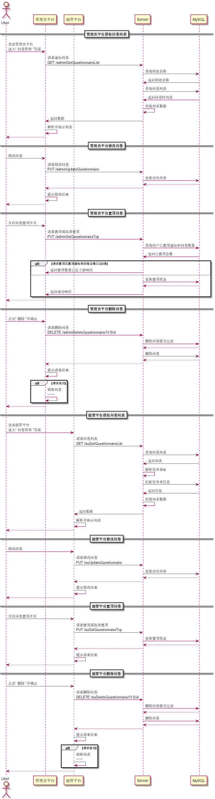

问卷管理共有八个过程：管理员平台获取问卷列表、管理员平台修改问卷、管理员平台置顶问卷、管理员平台删除问卷、超管平台获取问卷列表、超管平台修改问卷、超管平台置顶问卷、超管平台删除问卷。

班级管理员登录管理员平台进入问卷管理页，管理员平台会分页请求服务端获取该管理员发布的问卷列表，服务端会从MySQL数据库中查询班级名称和问卷列表，经过封装后返回到管理员平台，管理员平台将数据渲染到问卷列表上。

班级管理员点击问卷标题或正文的单元格可以对标题或正文进行修改，点击“详情”可以修改问题或删除问题，修改完成后管理员平台会请求服务端更新MySQL数据库中问卷的相应字段值。

班级管理员点击问卷列表中的置顶开关，管理员平台会请求服务端开启或取消问卷置顶，服务端会先检查置顶数量是否已达上限，如果已达上限则请求置顶失败，否则更新MySQL数据库中问卷的置顶标志。

班级管理员点击问卷列表中的“删除”按钮并确认，管理员平台会请求服务端删除MySQL中的问卷记录。

超级管理员登录超管平台进入问卷管理页，超管平台会分页请求服务端获取所有问卷列表，服务端会从MySQL数据库中查询问卷列表和对应的发布者信息，经过封装后返回到超管平台，超管平台将数据渲染到问卷列表上。

超级管理员点击问卷标题或正文的单元格可以对标题或正文进行修改，点击“详情”可以修改问题或删除问题，修改完成后超管平台会请求服务端更新MySQL数据库中问卷的相应字段值。

超级管理员点击问卷列表中的置顶开关，超管平台会请求服务端开启或取消通知置顶，服务端将更新MySQL数据库中问卷的置顶标志。

超级管理员点击问卷列表中的“删除”按钮并确认，超管平台会请求服务端删除MySQL中的问卷记录。

###### 提交问卷

提交问卷涉及用户角色为普通用户，涉及技术平台为QQ小程序、服务端、MySQL数据库，时序图如图TODO所示。

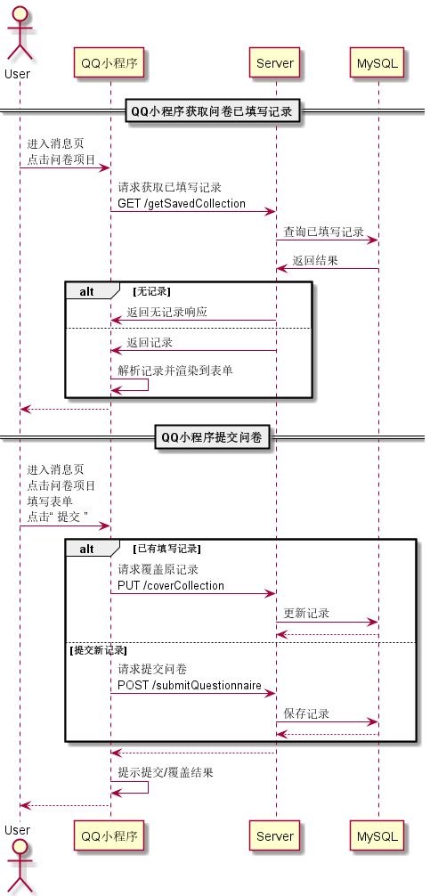

提交问卷共有两个过程：获取已填写记录、提交问卷。

用户点击消息页的问卷项进入详情页，小程序会请求服务端获取问卷的填写记录，服务端查询MySQL数据库中的问卷填写记录，如有记录就返回给小程序，小程序自动将填写记录填充到表单上。

用户填写完表单后点击“提交”按钮，如果已有填写记录小程序会请求服务端覆盖原填写记录，服务端直接更新MySQL数据库中的填写记录，如果是首次提交小程序会请求服务端保存填写记录，服务端直接将填写记录存入MySQL数据库。

###### 问卷收集

问卷收集涉及用户角色为班级管理员、超级管理员，涉及技术平台为管理员平台、超管平台、服务端、MySQL数据库，时序图如图TODO所示。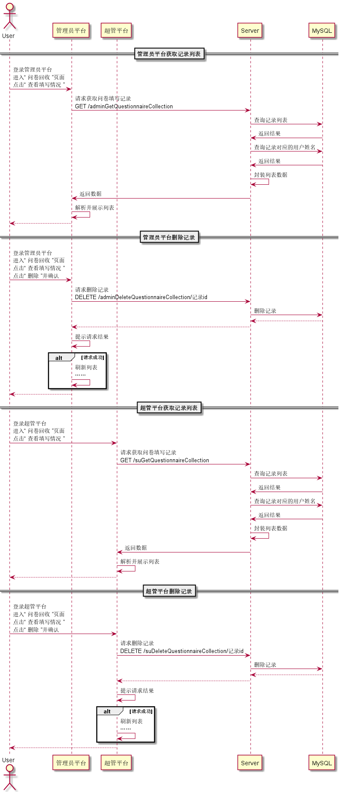

问卷收集共有四个过程：管理员平台获取记录列表、管理员平台删除记录、超管平台获取记录列表、超管平台删除记录。

班级管理员登录管理员平台进入问卷回收页点击问卷列表项的“查看填写情况”按钮，管理员平台会分页请求服务端获取记录列表，服务端会查询MySQL数据库中的填写记录和记录提交用户的姓名，封装后返回给管理员平台，管理员平台将数据渲染到记录列表。

班级管理员点击记录列表项的“删除”按钮并确认，管理员平台会请求服务端删除填写记录，服务端会直接删除MySQL数据库中的填写记录。

###### 获取消息

获取消息涉及用户角色为普通用户，涉及技术平台为QQ小程序、Android客户端、服务端、MySQL数据库，时序图如图TODO所示。

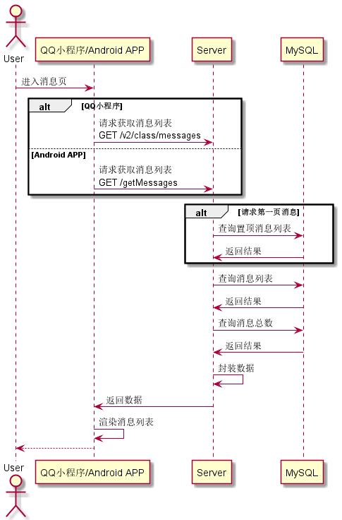

用户进入小程序/APP消息页，小程序/APP会请求服务端获取消息列表，服务端会从MySQL数据库中查询一页消息列表和消息总数，如果请求的是第一页服务端会从MySQL数据库中查询出置顶消息列表，将所有数据封装后返回给小程序/APP，小程序/APP将数据渲染到消息列表。

虽然小程序和APP请求的服务端接口不同，但是功能实现原理和最终数据格式基本一致。

##### 班级

###### 加入班级

加入班级涉及用户角色为班级管理员，涉及技术平台为管理员平台、服务端、MySQL数据库，时序图如图TODO所示。

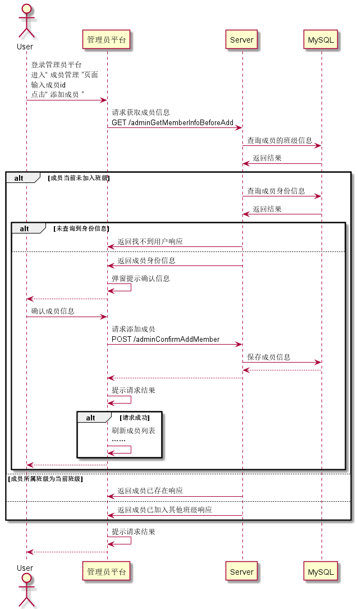

班级管理员登录管理员平台进入成员管理页输入成员id，点击“添加成员”按钮，管理员平台会请求服务端添加成员，服务端查询成员是否已经加入了班级，如果已加入其它班级或者本班会直接返回相应的响应，如未加入会将成员信息返回给管理员平台，供班级管理员确认，班级管理员确认后管理员平台会请求服务端确认添加成员，服务端将关联信息存储到MySQL数据库。

###### 成员管理

成员管理涉及用户角色为班级管理员，涉及技术平台为管理员平台、服务端、MySQL数据库，时序图如图TODO所示。

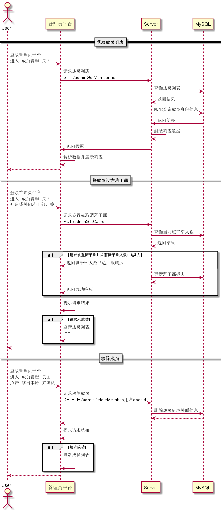

成员管理共有三个过程：获取成员列表、将成员设为班干部、移除成员。

班级管理员登录管理员平台进入成员管理页，管理员平台会请求服务端获取班级成员列表，服务端查询MySQL数据库中的成员列表和成员对应的身份信息经过封装后返回给管理员平台，管理员平台将数据渲染到成员列表上。

班级管理员点击成员列表中的班干部开关，管理员平台会请求服务端将成员设为班干部，服务端会检查当前班干部人数是否达到8人的限制，如已达上限则设置班干部失败，否则服务端会更新MySQL数据库中成员的班干部标志。

班级管理员点击成员列表中的“移出本班”按钮确认，管理员平台会请求服务端删除MySQL中的成员和班级关联信息。

##### 超管设备鉴权

###### 权限验证

权限验证涉及用户角色为超级管理员、项目Owner，涉及技术平台为超管平台、超管设备管理客户端、服务端、MySQL数据库，时序图如图TODO所示。

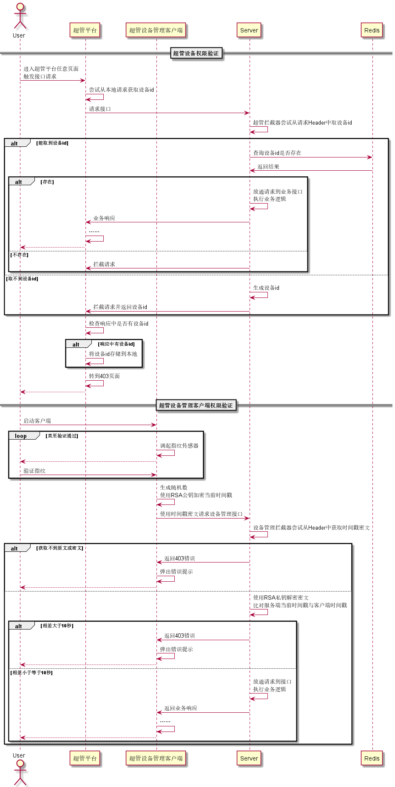

权限验证共有两个过程：超管设备权限验证、超管设备客户端权限验证。

超级管理员访问超管平台页面需要通过超管设备验证，进入超管平台任意页面使用任意功能时超管平台会尝试从本地获取设备id，将设备id放入请求的Header中，服务端超管拦截器会尝试从Header中取得设备id，如果Header中不存在设备id，服务端会生成一个设备id返回给超管平台供超管平台请求授权，如果Header中存在设备id，服务端会将设备id格式化为key，查询Redis数据库中是否存在该key，如不存在则验证不通过，否则放通请求到对应接口，超管平台如果在响应中收到了服务端生成的设备id会将其存储到本地存储供后续授权使用。

项目Owner在使用超管设备管理客户端时会接受更加严格的验证，在客户端启动时会调用指纹传感器要求项目Owner验证指纹，只有当指纹验证后客户端才会执行主要逻辑，每次请求服务端时，客户端会使用客户端内置的RSA公钥对当前时间戳进行加密，将时间戳密文放入请求的Header中，服务端设备管理拦截器会尝试从Header中获取时间戳密文，使用服务端的RSA私钥对密文进行解密，将解密结果与服务端当前时间戳进行对比，如果相差10秒内则验证通过，放通请求到相应接口，否则验证失败，返回403错误。

###### 申请授权

申请授权涉及用户角色为超级管理员，涉及技术平台为超管平台、全平台超管设备授权工具、服务端、MySQL数据库、Redis数据库，时序图如图TODO所示。

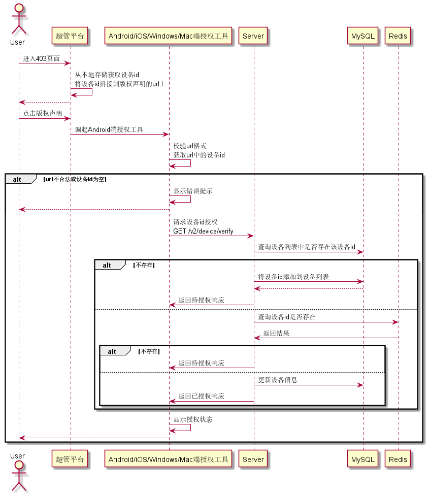

超管平台收到无权限响应后会跳转到403错误页，该页面内版权信息部分为超链接，页面会从本地存储获取设备id，将其拼接到超链接的参数部分，超级管理员点击超链接后浏览器会启动对应平台的授权工具，授权工具解析超链接获取其中的设备id，请求服务端将设备id加入设备列表供管理员授权使用，如果设备列表内已有该设备id，服务端会将设备id格式化为key，查询Redis数据库中是否存在该key，如果存在则更新对应的设备信息，如果设备列表内不存在该设备id则将设备id存入MySQL数据库的设备列表中。

###### 授权管理

授权管理涉及用户角色为项目Owner，涉及技术平台为超管设备管理客户端、服务端、MySQL数据库、Redis数据库，时序图如图TODO所示。

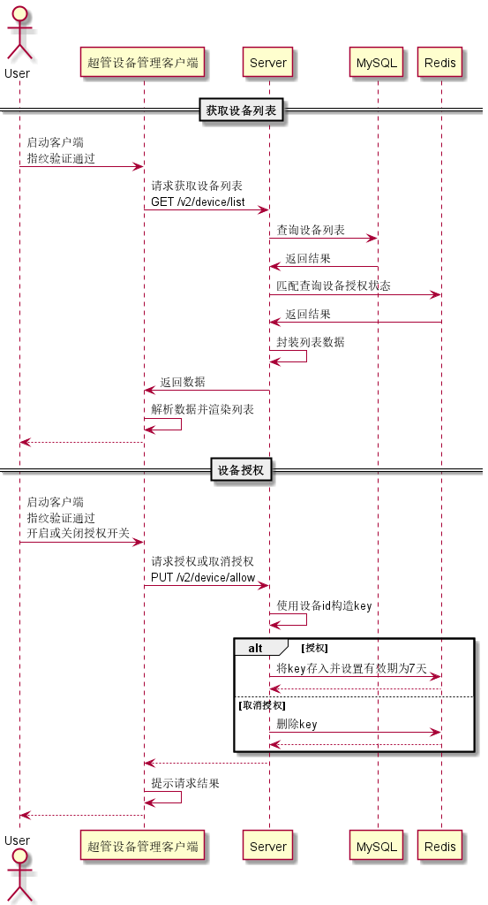

授权管理共有两个过程：获取设备列表、设备授权。

项目Owner进入客户端主页，客户端会请求服务端获取设备列表，服务端从MySQL数据库查询设备列表，从Redis数据库查询设备列表内设备的授权状态，经过封装后返回给客户端，客户端将数据渲染到设备列表上。

项目Owner点击设备列表中的授权开关，客户端会请求服务端授权或取消授权，如请求授权服务端会将设备id格式化为key，存入Redis数据库，请求取消授权服务端会删除Redis数据库中对应的key。

##### 数据统计

###### 数据采集

数据采集涉及用户角色为普通用户，涉及技术平台为QQ小程序、Android客户端、服务端、MySQL数据库、Redis数据库，时序图如图TODO所示。

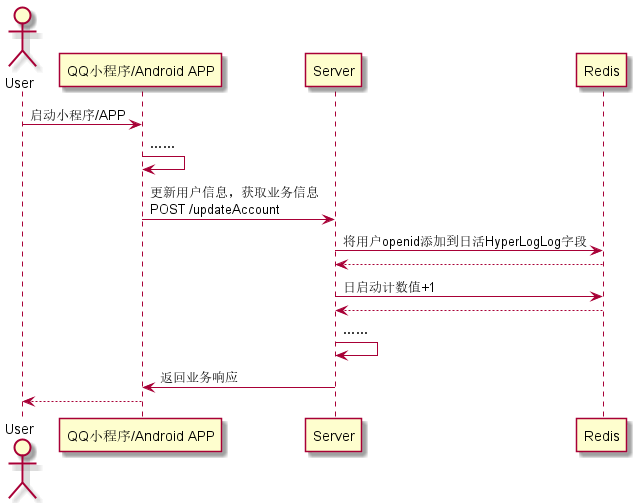

用户在触发小程序的用户信息更新流程时，服务端会将用户的openid存储到Redis数据库内的日活HyperLogLog字段内，将Redis数据库内的日启动次数计数值增加1。

在每日0时时，服务端定时任务会将上述两项数据和前一日的时间戳插入对应字段的列表并将上述两个字段的值清零。

其余统计指标为调取时实时查询，无需采集。

###### 数据面板

数据面板涉及用户角色为班级管理员、超级管理员，涉及技术平台为管理员平台、超管平台、服务端、MySQL数据库、Redis数据库，时序图如图TODO所示。

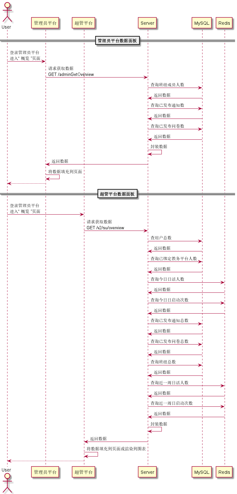

数据面板共有两个过程：管理员平台数据面板、超管平台数据面板。

班级管理员进入管理员平台概览页，管理员平台会请求服务端获取统计数据，服务端从MySQL数据库中查询班级成员人数和班级已发布通知数，封装后返回管理员平台，管理员平台将数据渲染到页面上。

超级管理员登录超管平台进入概览页，超管平台会请求服务端获取统计数据，服务端从MySQL数据库中查询用户总数、已绑定教务平台人数、已发布通知总数、已发布问卷总数、班级总数，从Redis数据库查询今日日活人数，今日日启动次数、近一周日活人数、近一周日启动次数，经过封装后返回给超管平台，超管平台将数据渲染到页面上。

##### APP测试鉴权

###### 权限验证

权限验证涉及用户角色为普通用户，涉及平台为Android客户端、服务端、MySQL数据库，时序图如图TODO所示。

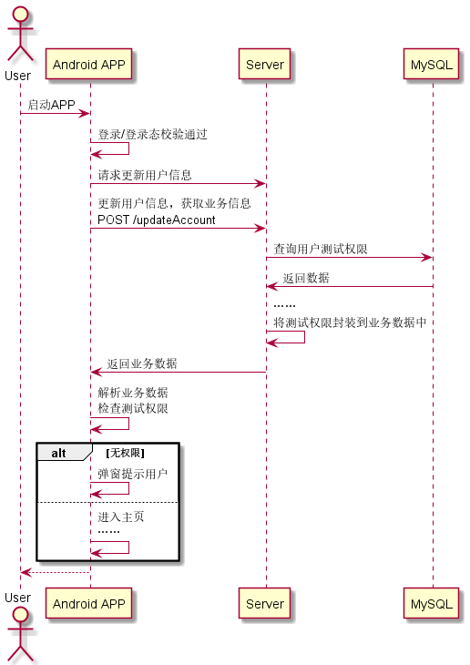

用户启动测试版APP时APP会在更新用户信息阶段从服务端返回的响应中取得用户的测试权限标志，如果用户没有测试权限将弹窗引导用户申请测试权限，如果用户有测试权限，APP会正常跳转到主页。

###### 申请授权

申请授权涉及用户角色为普通用户，涉及平台为Android客户端、权限申请Web页面，待审核Web页面、已提交Web页面、服务端、MySQL数据库，时序图如图TODO所示。

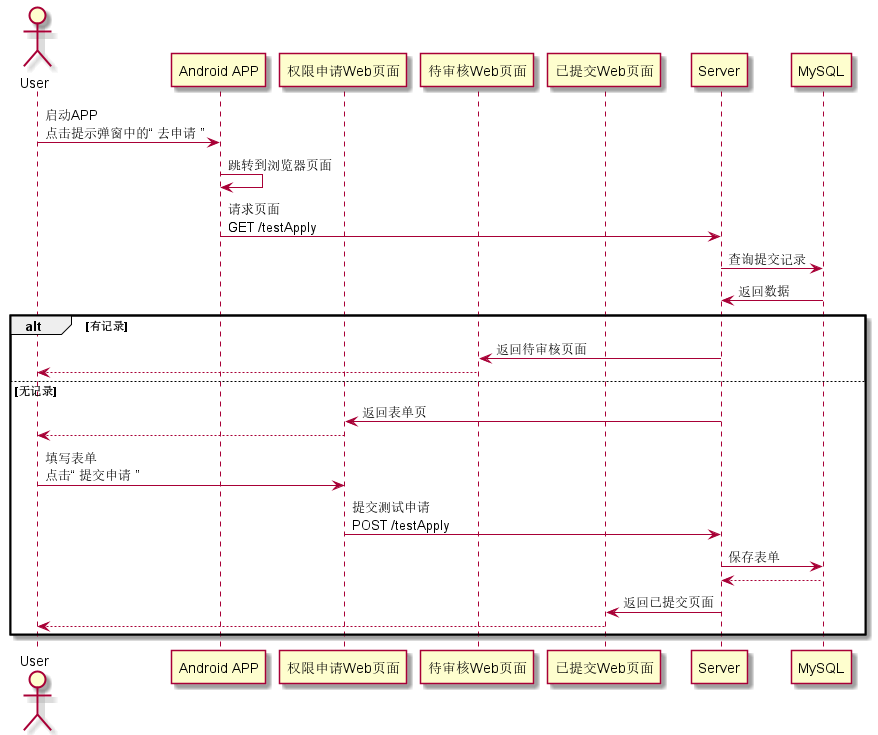

用户点击引导弹窗中的“去申请”，APP会跳转到浏览器页面，请求服务端权限申请Web页面，服务端查询MySQL数据库中的申请提交记录，如用户已提交过申请会返回待审核页面，如用户未提交过申请会返回权限申请页面，用户填写表单点击“提交申请”按钮后页面会请求服务端提交申请，服务端将申请信息保存到MySQL数据库中，返回已提交页面。

###### 授权管理

授权管理涉及用户角色为超级管理员，涉及平台为超管平台、服务端、MySQL数据库，时序图如图TODO所示。

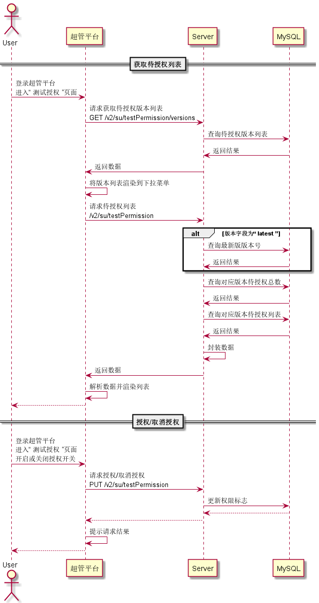

授权管理共有两个过程：获取待授权列表、授权/取消授权。

超级管理员登录超管平台进入测试授权页，超管平台会请求服务端获取版本号列表，服务端查询MySQL数据库中的版本号列表返回给超管平台，超管平台将版本号列表渲染到下拉菜单中后再次请求服务端获取待授权列表，服务端核对超管平台请求的版本号，如果是“latest”服务端会从MySQL数据库中查询出最新的版本号，然后服务端使用最终的版本号查询待授权列表返回给超管平台，超管平台将待授权列表数据渲染到待授权列表上。

超级管理员点击待授权列表中的授权开关，超管平台会请求服务端授权或取消授权，由服务端更新MySQL数据库中用户的权限标志。

##### Banner

###### 获取Banner列表

获取Banner列表涉及用户角色为普通用户，涉及平台为QQ小程序、Android APP、服务端、MySQL数据库，时序图如图TODO所示。

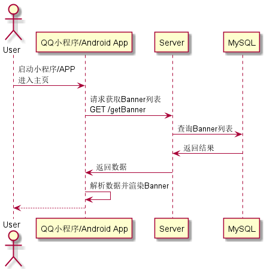

用户进入小程序/APP主页，小程序/APP会请求服务端获取Banner列表，服务端按照优先级逆序查询启用的Banner列表返回给小程序/APP，小程序/APP进行解析和渲染。

###### 获取Banner关联消息

获取Banner关联消息涉及用户角色为普通用户，涉及平台为QQ小程序、Android APP、服务端、MySQL数据库，时序图如图TODO所示。

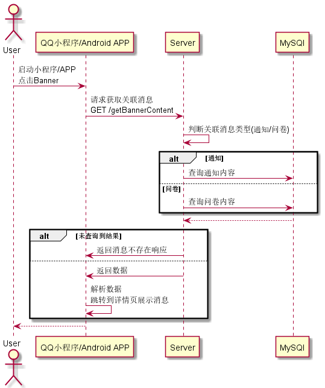

用户点击小程序/APP首页Banner，小程序/APP会请求服务端获取Banner关联的消息，服务端根据消息类型从MySQL数据库中查询消息内容，如果消息存在直接返回给小程序/APP，小程序/APP携带消息内容跳转到消息详情页进行渲染。

###### Banner管理

Banner管理涉及用户角色为超级管理员，涉及平台为超管平台、服务端、MySQL数据库、COS对象存储，时序图如图TODO所示。

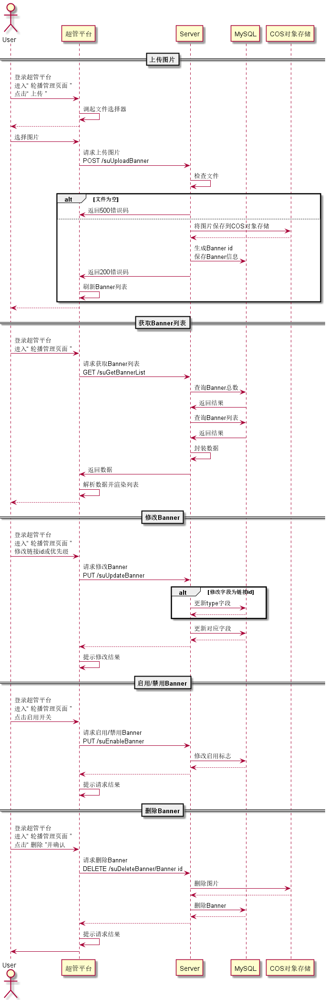

Banner管理共有五个过程：上传图片、获取Banner列表、修改Banner、启用/禁用Banner、删除Banner。

超级管理员登录超管平台进入轮播管理页，点击“上传”按钮，超管平台会调起文件选择器，用户选择图片后超管平台请求服务端上传图片，服务端对文件进行检查后调用COS Java SDK将图片存储到COS对象存储，服务端为图片生成Banner id，将Banner初始信息保存到MySQL数据库中，最后超管平台接收到成功响应后会执行Banner列表刷新流程。

超级管理员进入轮播管理页，超管平台会请求服务端分页获取Banner列表，服务端查询MySQL数据库中的Banner总数和指定页的Banner列表数据，经过封装后返回给超管平台，超管平台将数据渲染到Banner列表上。

超级管理员点击Banner列表中的链接id或优先级单元格可以对相应字段进行修改，修改完成后超管平台会请求服务端修改对应字段值，服务端更新MySQL数据库中相应字段的值，如果修改的是链接id，服务端还会根据修改的值更新type字段。

超级管理员点击Banner列表中的启用开关控制Banner是否在用户端展示，超管平台会请求服务端启用或禁用Banner，服务端对MySQL中Banner的启用标志进行修改。

超级管理员点击Banner列表中的“删除”按钮并确认，超管平台会请求服务端删除Banner，服务端调用COS Java SDK从COS对象存储中删除Banner对应的图片文件后删除MySQL数据库中的Banner记录。

##### APP版本更新

APP版本更新涉及用户角色为普通用户，涉及平台为Android客户端、服务端，时序图如图TODO所示。

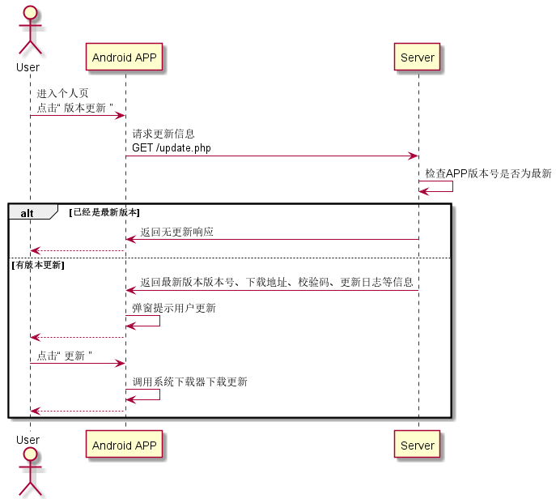

用户进入个人页点击“版本更新”，APP会请求服务端检查是否有更新，服务端检查当前版本是否为最新版，如没有更新会返回无更新响应，如有更新会返回最新版本的版本号、下载地址、校验码、更新日志等信息。如果APP收到了有更新响应会弹窗向用户展示最新版本的相关信息，用户确认更新后APP会调起系统下载器下载最新版本安装包，下载完成后用户可以手动安装最新版本。

### 项目运行环境配置

##### Docker环境配置

##### 负载均衡配置

服务端负载均衡使用Nginx实现，需要在Nginx的配置文件中的upstream部分配置被代理服务的地址和负载均衡的算法。负载均衡算法有四种：热备份、轮训、加权轮训、ip_hash。本项目所使用是热备份算法，在upstream部分备份服务的地址后加backup即可。

##### Redis数据库配置

由于超管设备授权和通知正文插入图片涉及到监听Redis数据库中key过期的需求，需要将Reidis配置文件中的notify-keyspace-events参数设置为“Ex”来开启Redis的key过期事件通知。

##### QA环境配置

测试是项目开发过程中非常重要的一环，为了保证线上服务的稳定运行，测试工作应在独立的线下环境中进行。因此，需要在进行开发的计算机上进行QA环境搭建，线上环境与QA环境对比如表TODO所示。

| 服务         | 线上环境                   | QA环境                                   |
| ------------ | -------------------------- | ---------------------------------------- |
| JDK          | OpenJDK 8u292 Docker镜像   | JDK 1.8.0_191 + OpenJDK 8u292 Docker镜像 |
| MySQL        | MariaDB 10.2.38 Docker镜像 | MySQL 5.7.26 - PHP study集成环境         |
| Redis        | Redis 6.2.6 Docker镜像     | Redis 6.2.6 Docker镜像                   |
| Web服务      | Nginx 1.21.3 Docker镜像    | Apache 2.4.39 - PHP study集成环境        |
| 负载均衡服务 | Nginx 1.21.5 Docker镜像    | 单服务测试                               |
| PHP          | PHP 7.4.8 Docker镜像       | PHP 7.3.4 nts - PHP study集成环境        |

此外QA环境需要使用Charles进行服务地址映射，从而实现不修改请求地址请求测试服务。

### 安全防护

##### 证书配置

为了网络通信的安全性需要为项目配置证书，实现HTTPS协议访问，涉及的技术平台有：SpringBoot服务、Nginx Web服务、Nginx负载均衡服务、COS对象存储。SpringBoot服务使用Tomcat证书，需要将证书随项目一起部署到运行环境中，在配置文件中配置证书路径和证书密码。Nginx Web服务、Nginx负载均衡服务使用Nginx证书，需要将证书文件和私钥复制到容器中，在配置文件中配置证书文件路径、私钥文件路径、TLS协议版本、加密套件等参数。因为证书从腾讯云平台申请，配置COS对象存储证书时可以直接在COS控制台绑定已申请的证书。

##### SSH密钥配置

为了提高服务器的安全性，需要将服务器的登录方式密码登录改为SSH密钥登录，可在腾讯云控制台生成SSH密钥保存到本地，在服务器控制台关联生成的SSH密钥。

##### 安全组配置

通过配置安全组可以控制服务对外网开放。本项目只需对外开放负载均衡服务和Nginx Web服务，这两个服务与其他服务的通信可以在内网环境中完成，所以其他服务的端口无需对外网开放。

##### 代码脱敏

由于项目代码将来可能会托管到外部平台，为了线上服务的安全性，诸如数据库密码、COS密钥等敏感信息应该从代码中剥离出来，一个非常好的办法就是利用环境变量，将代码中的敏感信息存储到开发机和服务器的环境变量中，项目运行时从环境变量中读取相关信息。

### 政策合规

##### 用户协议

用户协议能够明确软件厂商与用户之间的权责关系，具有实际的法律效力。当软件厂商与用户发生纠纷时，用户协议能够很大程度上保障双方的合法权益。本项目针对QQ小程序和Android客户端均制定了较为完善的用户协议，小程序用户可在个人页内点击“关于”查阅，APP用户可在个人页点击“关于”-“用户协议”查阅。

##### 隐私政策

隐私政策是Android应用上架应用商店的必要条件之一，同时国家相关法律也对应用处理个人信息作出了相关规定。基于应用平台相关要求和国家相关法律法规的规定，本项目针对Android客户端制定了清晰的隐私政策，对应用获取、处理、存储、使用用户个人信息的目的和方式作出了明确的解释，用户可在个人页点击“关于”-“隐私政策”查阅。

##### 隐私说明

依据QQ小程序平台政策要求小程序调用用户隐私信息相关接口，需在小程序内提供“隐私说明”，详细并明确告知用户隐私信息具体场景及用途。基于上述政策要求，本项目针对QQ小程序按照平台要求制定了隐私说明，用户可在个人页点击“隐私说明”查阅。

##### 软件著作权

软件著作权登记不仅是APP上架的必要的条件之一，也是保障软件开发者合法权益的重要途径。本项目QQ小程序、Android客户端、服务端均已进行软件著作权登记，QQ小程序登记号：2020SR1271518，Android客户端登记号：2021SR1664477，服务端登记号：2021SR1664476。

### APP稳定性检测

##### 内存泄漏检测

内存泄漏的本质表现是对象使用完成后由于使用中的对象对该对象仍持有引用导致该对象无法被垃圾回收器回收。内存泄漏对APP的运行有很大的危害，轻则会使APP内存占用升高、耗电量增加，重则会直接导致APP崩溃。为了防止APP出现内存泄漏，本项目Android客户端使用了LeakCanary框架进行内存泄漏检测，进而及时修复导致内存泄漏的根源。使用LeakCanary只需要在项目中添加依赖，在应用debug版本运行时它会自动检测内存泄漏，如发生内存泄漏会显示通知提示，点击通知可查看对象的引用链和内存泄漏的详细信息。

##### 崩溃/异常监控

APP不同于小程序的一点是一旦发生未被处理的异常就会导致页面甚至整个APP的崩溃，因此需要对APP的异常和崩溃进行监控，从而排查问题原因尽快进行修复。本项目接入了腾讯Bugly SDK捕捉应用异常和监控应用崩溃，使用Bugly SDK需要将其依赖添加到项目中，在项目清单中配置应用相关参数，在APP启动时初始化SDK，此外对异常上报策略进行配置。

### 反馈渠道

为了提升用户体验、及时修复产品问题，本项目QQ小程序和Android客户端均设置了反馈入口。小程序使用了小程序官方提供的基于腾讯兔小巢平台的反馈组件，开发者可以在兔小巢后台查看用户反馈，也可以配置每日反馈推送。Android端使用了兔小巢的移动端反馈页面，用户点击反馈入口后APP会跳转到浏览器页面展示兔小巢移动端反馈页面。

### 项目部署和上线

##### 小程序提交审核

小程序需要经过QQ小程序官方审核后才能上线，项目开发完成时需要使用小程序开发工具的上传功能，将小程序包上传到小程序后台，登录小程序后台，在版本管理版块填写审核信息后提交审核。

##### 小程序发布

小程序审核通过后可以在小程序后台版本管理版块进行发布，发布时可以选择全量发布或者灰度发布，使用QQ扫码确认后即可发布成功。

##### APP打包

APP打包需要先生成一个签名证书，在Android Studio的“Build”菜单，选择“Generate Signed Bundle/APK ...”，配置证书和签名信息后可以初步打出Release包，为了提高安装包的安全性，本项目使用360加固助手对安装包进行了加固。

##### APP审核上架

不同的应用商店上架流程会有一些细微差异，但大体上是一致的。首先需要在各应用商店后台注册账号、填写开发者实名信息、提交审核，实名信息审核通过后创建应用、填写应用信息、上传安装包、提交审核，审核通过后一部分平台会自动上架应用，还有一部分需要开发者手动发布。

##### 服务端生成镜像

服务需要以镜像的形式部署到服务器上，首先需要将SpringBoot服务打成jar包，然后使用docker build命令将相关资源生成Docker镜像，使用docker save命令将镜像输出到本地目录。

##### 服务端部署

部署镜像需要先将镜像包上传到服务端本地存储，然后使用docker load命令将镜像加载到Docker环境中。部署主服务时先要将主服务容器内重要数据拉取到本地，创建或启动备份服务容器，保障业务稳定运行。备份服务运行正常后可以结束线上主服务进程，此时用户端所有请求将被负载均衡服务转发到备份服务。最后将主服务容器删除后创建新版本主服务的容器，待主服务正常运行后用户端请求将被负载均衡服务转发到主服务。此时可以结束备份服务进程，服务部署流程结束。

### 项目总结

本项目涉及用户角色和平台较多，工作量较大。经过两年多时间的更新迭代，项目目前整体涵盖了QQ小程序、Android客户端、Web前端、Windows客户端、iOS客户端、MacOS客户端、Java后端、数据库等多个领域内的技术，实现了十个模块内的三十余个功能点，在项目运营方面依照国家相关法律法规和相关平台政策规定实现了运营合规，拥有了较为可观的用户量，成为了一个开发和运营体系较为完善的软件系统。

### 参考文献

[1]尹胜燕.基于LayUI框架的学生社团管理[J].大众投资指南,2019(05):129.

[2]左佳丽,刘文珊,张玲乐.校园生活综合服务平台小程序的设计与实现[J].无线互联科技,2021,18(11):62-63+78.

[3]李尚林,陈宫,雷勇.基于Java的网络爬虫系统研究与设计[J].新型工业化,2021,11(04):74-77+80.DOI:10.19335/j.cnki.2095-6649.2021.4.029.

[4]崔慧娟.MVVM模式在Android项目中的应用[J].信息与电脑(理论版),2021,33(06):1-3.

[5]何群芳,时招军.基于Android的内存泄漏与溢出研究[J].软件导刊,2018,17(02):50-52.

[6]张赛东,邓晓军,李玉龙,欧阳子谦.基于ARKit技术的文物交互式相机App设计与实现[J].湖南工业大学学报,2020,34(05):40-46.

[7]陈思. 基于Nginx和Redis的高并发Web场景下缓存的研究与设计[D].东华理工大学,2021.DOI:10.27145/d.cnki.ghddc.2021.000350.

[8]赵琳.基于CentOS 7系统实现Nginx负载均衡[J].网络安全和信息化,2022(02):96-99.

[9]张雷. 基于Docker的部署管理平台的研究与实现[D].中国石油大学(华东),2018.DOI:10.27644/d.cnki.gsydu.2018.001934.

[10]秦美虎.《个人信息保护法》背景下企业如何进行有效管理和风险防范[J].法制博览,2022(03):74-77.

### 致谢

写到这里这篇篇幅稍长的毕业论文即将完稿，伴随着毕业论文的完成我的大学生活和整个学生生涯都将画上一个句号了。此时此刻，有太多的人是我要感谢的。

首先感谢我的指导老师——于延老师对我的学习和论文写作的指导。大学四年里我在于老师教的科目中得的分数都很高，于老师的上课氛围很轻松，深受同学们的喜爱。很荣幸这个项目能得到于老师的关注，并得到了许多有价值的指导，使这个项目变得更好。

这个项目能够发展到今天离不开项目的另一位创始人——刘楠，她在项目初期的设计和推广阶段付出了许多精力，为项目在比赛中的数据作出了巨大的贡献。

感谢百度集团为我提供了实习的机会和优质的学习资源，在这里我积累了非常多的知识和经验，让我对我的技术和职业发展有了更多的思考。也要感谢百度员工庄琦、林丽对项目苹果应用开发的支持和帮助，使苹果应用开发能够高效完成。

感谢项目的所有用户，因为有他们的信任和支持我才能将项目维护和运营至今。

最后要感谢我学生生涯中的每一所学校、每一位老师和同学，非常有幸能遇见他们，我今天的所有成就都离不开他们过去的支持。
